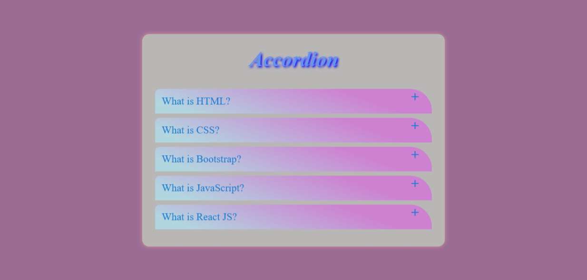
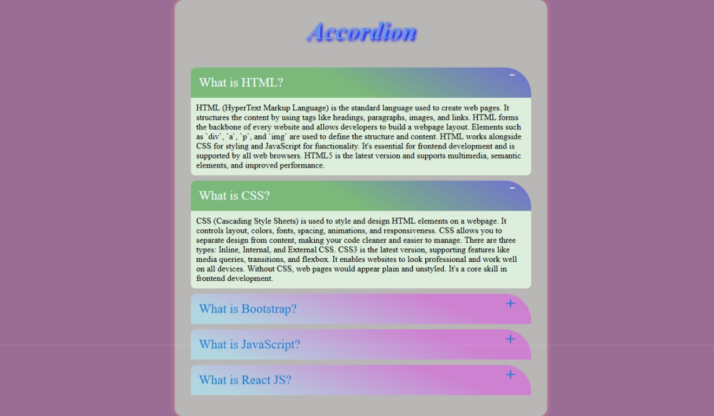

# Accordion Task

This is a simple and responsive Accordion-style webpage created using **HTML**, **CSS**, and **JavaScript**. Clicking each section title expands or collapses the content with smooth transitions and attractive colors.

## 🚀 Live Demo

👉 [Click here to view the live project](https://msdhinesh45.github.io/accordian/)

## 🛠️ Technologies Used

- HTML5
- CSS3 
- JavaScript 

## 📸 Screenshot

### Output Preview:

## ✨ Features

- Click to expand/collapse answers
- Smooth color transitions
- Lightweight and clean design

## 🙋‍♂️ Author

**Dhinesh Kumar**  

---

